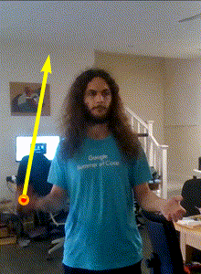

# Juggle Tracker

Tracks juggling in a video.

Uses a neural network to locate balls and then a probabilistic model on top of
that to determine the ball trajectories, how many times they are caught and
thrown, and what patterns are being juggled.

This is a work in progress so most of that doesn't exist yet.

This is not an officially supported Google product.
